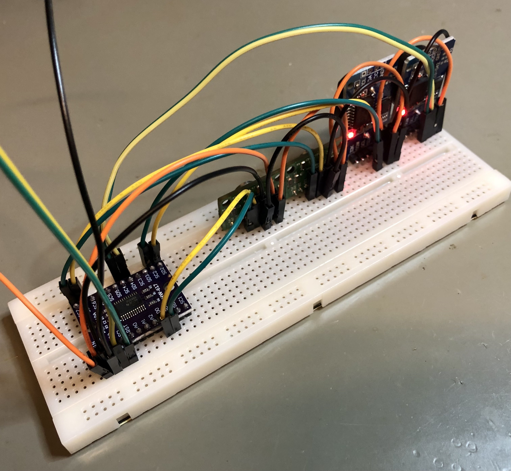

# rv3028c7-rtc

Rust `no_std` driver for RV-3028-C7 and similar Real Time Clocks (RTC),
provided by Micro Crystal, Switzerland. 
Based on the
[Application Manual](https://www.microcrystal.com/fileadmin/Media/Products/RTC/App.Manual/RV-3028-C7_App-Manual.pdf)
downloaded November 2023.

This driver provides basic methods for reading and writing the i2c registers of the RTC,
but it does not exercise all the features of the RTC. 

## Running examples

Currently all of the examples have been run and tested on a raspberry pi running linux, for example:
```
cargo run --example rpil
 ```
from the linux command line.

- [`rpil`](./examples/rpil.rs) demonstrates some basic interactions with the RTC.
- [`muxit`](./examples/muxit.rs) demonstrates talking to two RTCs (with the same i2c address) via a TCA9548A-like i2c mux. 
See the [high-level wiring diagram schematic](./res/dual-rtc-schematic.pdf).
- [`comp`](./examples/comp.rs) compares the output of four independent RTCs (two each of RV-3028-C7 and DS3231)
and detects when they drift apart (usually after multiple days).
See the associated [quad RTC wiring diagram](./res/comp-quad-rtc-mux.pdf).


## Testing

By default, `cargo test` currently also builds all examples,
and if you're testing on a non-linux platform the Raspberry Pi example will fail. 
You can use the following to only build tests:

```
cargo test --tests
```

## Funstuff

Here's a breadboard with four RTCs connected via an i2c mux (for the RTC [comparison example](./examples/comp.rs))
